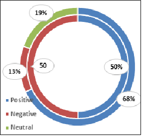

# HARD: Hotel Arabic-Reviews Dataset
- [Description](#description)
- [Dataset](#dataset)
- [Citation](#citation)

## Description

This dataset contains **93700** hotel reviews in Arabic language. The hotel reviews were collected from [Booking.com](http://www.booking.com) website during June/July 2016. The reviews are expressed in Modern Standard Arabic as well as dialectal Arabic. 
The following table summarize some tatistics on the HARD Dataset.

| Property                  | Number  	| Property                  | Number    	|
|--------------------------	|---------	|--------------------------	|-----------	|
| Number of reviews        	| 373,750 	| Median reviews per hotel 	| 150       	|
| Number of hotels         	| 1,858   	| Min reviews per hotel    	| 3         	|
| Avg. reviews per hotel   	| 264     	| Number of users          	| 30,889    	|
| Max reviews per hotel    	| 5,793   	| Avg. reviews per user    	| 15.8      	|
| Median reviews per hotel 	| 150     	| Number of tokens         	| 8,520,886 	|

The following figure depicts the reviews distribution in HARD Datasets; balanced (inner) and unbalanced (outer).

You may refer to our paper, cited below, for details on the dataset.

## Dataset

- data/
                      
  - balanced-reviews.tsv: a tab separated file containing a balanced dataset of positive and negative reviews. The ratings are 
                     mapped into positive (ratings 4 & 5) and negative (ratings 1 & 2). No nuetral reviews are included. 
                     The dataset consists of **93700** reviews; **46850** for each positive and negative classes.
                     
   - balanced-reviews.csv: same as above dataset but using the CSV format. The format of each review record is:
                     
                     rating<TAB>sentiment<TAB>review_id<TAB>hotel_id<TAB>user_id<TAB>no_nights<TAB>review

  - unbalanced-reviews.tsv.rar: the whole dataset of **373,750** reviews. This is a *clean* dataset that includes all reviews.
  
  - unbalanced-reviews.csv.rar: same as above dataset but using the CSV format.  The format of each review record is:
                     
                     rating<TAB>review_id<TAB>hotel_id<TAB>user_id<TAB>no_nights<TAB>review
                     
    where:
                     rating: the user rating on a scale of 1 to 5
                     sentiment: -1 (negative) and 1 (positive) *For the balanced dataset*
                     review id: the id of the review (to access the review of a specific review)
                     hotel id: the id of the hotel
                     user id: the type of user (single, couple, ...)
                     nights: number of nights stayed in the hotel
                     review: the text of the review
                      
## Citation

Please cite the following paper if you decise to use the dataset:

    Elnagar A., Khalifa Y.S., Einea A. (2018) Hotel Arabic-Reviews Dataset Construction for Sentiment Analysis Applications. 
    In: Shaalan K., Hassanien A., Tolba F. (eds) Intelligent Natural Language Processing: Trends and Applications. 
    Studies in Computational Intelligence, vol 740, pp: 35-52. Springer International Publishing. 
    doi="10.1007/978-3-319-67056-0_3. url="https://doi.org/10.1007/978-3-319-67056-0_3"
